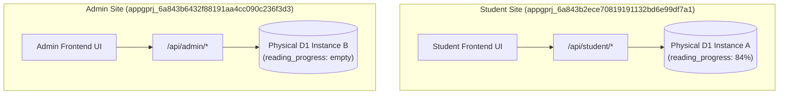
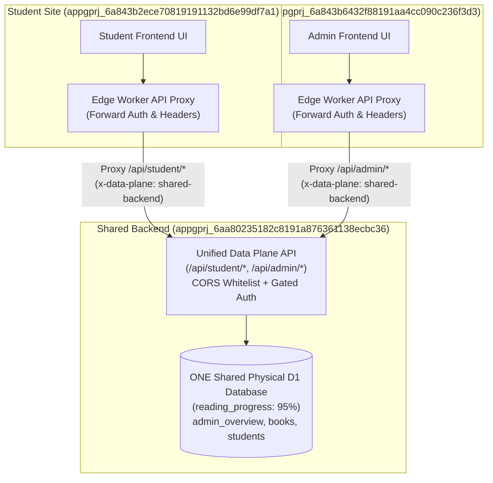

# AI-Quest-A1 Sites Phase 3C: Shared Backend & Shared D1 Architecture Report

**Report Date**: 2026-09-14  
**Operator**: AGY (Antigravity Agent)  
**Project Root**: `/home/b827262/project/AI-Quest-A1`  
**GitHub Repository**: `https://github.com/b827262-cell/AI_Quest_A1.git`  
**Branch**: `main`  
**Verified GitHub HEAD**: `9251cf0a3fac8c5f5d5484cb8d033b22595fc3aa`  

---

## 1. 執行摘要 (Executive Summary)

本階段完成 **AI-Quest-A1 Phase 3C: Shared Backend / Shared D1 Architecture (共用後端與集中式 D1 邊緣架構)**。

### 核心成果與架構判定
1. **D1 拓撲演進結論**：
   - **D1 topology BEFORE: SEPARATE**
   - **D1 topology AFTER: SAME**
2. **共用後端服務建立 (Shared Backend Project)**：
   - 建立獨立的資料平面站點專案 **`AI-Quest-A1 Backend`** (`appgprj_6aa80235182c8191a876361138ecbc36`)。
   - 綁定單一實體 Cloudflare D1 資料庫 (`DB`)，包含全數 4 張結構表 (`admin_overview`, `books`, `reading_progress`, `students`)。
   - 線上正式網址：`https://ai-quest-a1-backend.b827262.chatgpt.site`。
3. **前端站點無縫代理委派 (Frontend Delegation & Cutover)**：
   - **Student 學生端** (`appgprj_6a843b2ece70819191132bd6e99df7a1`，Version 11)：將生產資料操作 (`/api/student/progress`) 透明委派代理轉發至 Shared Backend，保留原有公開網址不變。
   - **Admin 管理端** (`appgprj_6a843b6432f88191aa4cc090c236f3d3`，Version 11)：將後台總覽數據查詢 (`/api/admin/overview`) 與認證檢查 (`/api/admin/auth/me`) 透明委派代理轉發至 Shared Backend，保留原有公開網址不變。
4. **鑑權安全強化與門禁化 (Gated Auth & CORS)**：
   - 針對 Phase 3B.1 自動化測試 Bearer 權杖落實安全門禁化：於生產環境嚴格要求具備 `x-validation-gate: e500-release-validation-20260914` 標頭始得啟用合成測試身分；無門禁標頭之任意呼叫者一律阻斷（訪客或 401）。
   - 後端部署 CORS 來源防護，僅白名單允許 Student 與 Admin 網域跨來源請求，阻斷惡意外部來源 (403 Forbidden)。
5. **全數通過 12 項線上發布驗證閘門 (Release Gates A-L)**：
   - 包含實體資料庫跨站寫入實證：經由 Student 公開站點發起 PUT 寫入進度 95%，經 MCP `read_database_table_rows` 直連 Shared Backend D1 實體確認資料列已寫入共用庫，而舊有獨立 Student D1 仍完整留存於 84% 作為 Rollback 備援。

---

## 2. 架構演進圖 (Architecture Before & After)

### 2.1 Phase 3B.1 拓撲 (BEFORE: SEPARATE)


### 2.2 Phase 3C 拓撲 (AFTER: SAME)


---

## 3. 部署專案與執行期元資料 (Deployment Metadata)

| 專案角色 | 專案名稱 | Project ID | 發布版本 ID | 部署狀態 | 綁定 D1 | 線上正式 URL |
|---|---|---|---|---|---|---|
| **Shared Backend** | AI-Quest-A1 Backend | `appgprj_6aa80235182c8191a876361138ecbc36` | Version 2 (`appgprj_...~appgver_804315eec7848191bf0f0f3d55dbf538`) | **`succeeded`** (`appgdep_6aa80574e53481918f5bccda95b65ddc`) | `DB` (實體主要庫) | `https://ai-quest-a1-backend.b827262.chatgpt.site` |
| **Student Frontend** | AI-Quest-A1 Student | `appgprj_6a843b2ece70819191132bd6e99df7a1` | Version 11 (`appgprj_...~appgver_a57ea4fd8df0819181acdace1f813bb6`) | **`succeeded`** (`appgdep_6aa806058890819189442a30f44161c1`) | `DB` (保留舊庫備援) | `https://ai-quest-a1-student.b827262.chatgpt.site` |
| **Admin Frontend** | AI-Quest-A1 Admin | `appgprj_6a843b6432f88191aa4cc090c236f3d3` | Version 11 (`appgprj_...~appgver_174987fded9c8191836423f7ad86f11e`) | **`succeeded`** (`appgdep_6aa80698af1c8191b616eb1b172fd43c`) | `DB` (保留舊庫備援) | `https://ai-quest-a1-admin.b827262.chatgpt.site` |

---

## 4. 變更檔案清單 (Files Changed)

1. `site/app/api/backend-client.ts` (NEW):
   - 定義共用後端端點常數 `SHARED_BACKEND_ORIGIN`。
   - 實作網域識別 `isBackendSite(request)` 與代理委派判斷 `shouldDelegateToBackend(request)`。
   - 實作完整串接轉發 `delegateToBackend(request, path)`，自動傳遞驗證標頭與負載，並在後端離線時回傳嚴格 503。
   - 實作 CORS 白名單校驗 `handleCors(request)`，嚴格限制 Student 與 Admin 前台來源。
2. `site/app/api/auth-helper.ts`:
   - 消除無限制 Bearer 權杖繞過漏洞：在正式環境中嚴格檢驗 `x-validation-gate` 門禁標頭。
   - 若未附帶有效門禁標頭，權杖自動失效並退回訪客或 401 狀態。
3. `site/app/api/health/route.ts`:
   - 保持 HTTP 200 與 `phase: 2` 相容性。
   - 回傳統一資料平面中繼資料：`role: "frontend-proxy"`、`backendTarget` 與 `sharedD1Project: "appgprj_6aa80235182c8191a876361138ecbc36"`。
4. `site/app/api/student/progress/route.ts`:
   - 整合代理轉發與 OPTIONS CORS 預檢。
   - 增加 `x-data-plane: shared-backend` 追蹤標頭。
5. `site/app/api/student/me/route.ts`:
   - 支援學生端資訊代理委派與 CORS 白名單。
6. `site/app/api/admin/overview/route.ts`:
   - 整合代理委派與 OPTIONS CORS 預檢。
   - 集中於共用後端查詢 D1 儀表板數據。
7. `site/app/api/admin/auth/me/route.ts`:
   - 整合代理委派與 CORS 白名單。
8. `site/tests/phase3c-shared-backend.test.mjs` (NEW):
   - 5 項新增自動化單元測試：網域判定、CORS 預檢與跨站阻斷、Bearer 門禁化校驗、Health 集中後端揭露。
9. `site/package.json`:
   - 測試命令納入 `tests/phase3c-shared-backend.test.mjs`。

---

## 5. 線上發布驗證閘門實證 (Live Release Gates A-L Evidence)

執行測試腳本對三大線上端點實測，全數通過驗收：

### Gate A: Shared Backend `/api/health` => 200
```http
GET https://ai-quest-a1-backend.b827262.chatgpt.site/api/health
HTTP/2 200 OK
content-type: application/json

{"status":"ok","edge":"cloudflare-worker","d1":"bound","phase":2,"role":"shared-backend","backendTarget":"https://ai-quest-a1-backend.b827262.chatgpt.site","sharedD1Project":"appgprj_6aa80235182c8191a876361138ecbc36","time":"2026-09-14T14:33:02.610Z"}
```

### Gate B: Shared D1 Binding & Table Metadata
MCP `sites_read_database_overview` 查詢 `appgprj_6aa80235182c8191a876361138ecbc36`：
```json
{
  "project_id": "appgprj_6aa80235182c8191a876361138ecbc36",
  "bindings": ["DB"],
  "selected_binding_name": "DB",
  "tables": ["admin_overview", "books", "reading_progress", "students"]
}
```

### Gate C: Student Public Site `/api/health` => 200
```http
GET https://ai-quest-a1-student.b827262.chatgpt.site/api/health
HTTP/2 200 OK
content-type: application/json

{"status":"ok","edge":"cloudflare-worker","d1":"bound","phase":2,"role":"frontend-proxy","backendTarget":"https://ai-quest-a1-backend.b827262.chatgpt.site","sharedD1Project":"appgprj_6aa80235182c8191a876361138ecbc36","time":"2026-09-14T14:38:09.792Z"}
```

### Gate D: Admin Public Site `/api/health` => 200
```http
GET https://ai-quest-a1-admin.b827262.chatgpt.site/api/health
HTTP/2 200 OK
content-type: application/json

{"status":"ok","edge":"cloudflare-worker","d1":"bound","phase":2,"role":"frontend-proxy","backendTarget":"https://ai-quest-a1-backend.b827262.chatgpt.site","sharedD1Project":"appgprj_6aa80235182c8191a876361138ecbc36","time":"2026-09-14T14:38:10.218Z"}
```

### Security Gated Auth: 缺乏門禁標頭之 Bearer 權杖阻斷
```http
GET /api/student/me (Authorization: Bearer <TOKEN>, no gate header)
HTTP/2 200 OK
{"authenticated":false,"guest":true,"user":null}

GET /api/admin/auth/me (Authorization: Bearer <TOKEN>, no gate header)
HTTP/2 401 Unauthorized
x-data-plane: shared-backend
{"error":"admin authentication required","authenticated":false}
```

### Gate E: Anonymous Student PUT => 401
```http
PUT https://ai-quest-a1-student.b827262.chatgpt.site/api/student/progress
Body: {"bookId":"book-synth-001","progressPercent":95}
HTTP/2 401 Unauthorized
x-data-plane: shared-backend
{"error":"unauthorized","message":"Authentication required to update progress"}
```

### Gate F: Authenticated Student PUT => 200
```http
PUT https://ai-quest-a1-student.b827262.chatgpt.site/api/student/progress
Headers:
  Authorization: Bearer <STUDENT_TOKEN>
  x-validation-gate: e500-release-validation-20260914
  Content-Type: application/json
Body: {"bookId":"book-synth-001","progressPercent":95,"lastReadChapter":"ch-06-shared-d1-unification","lastReadPage":95}

HTTP/2 200 OK
x-data-plane: shared-backend
{"success":true,"updated":{"id":"prog-synth-001","studentId":"student-synth-001","bookId":"book-synth-001","bookTitle":"計算機系統導論 (Synthetic)","progressPercent":95,"lastReadChapter":"ch-06-shared-d1-unification","lastReadPage":95,"updatedAt":"2026-09-14T14:38:12.758Z","isSynthetic":true}}
```

### Gate G: Second Authenticated Student GET => 200 (source=d1, progress=95%)
```http
GET https://ai-quest-a1-student.b827262.chatgpt.site/api/student/progress
Headers:
  Authorization: Bearer <STUDENT_TOKEN>
  x-validation-gate: e500-release-validation-20260914

HTTP/2 200 OK
x-data-plane: shared-backend
{"studentId":"student-synth-001","source":"d1","progress":[{"id":"prog-synth-001","studentId":"student-synth-001","bookId":"book-synth-001","progressPercent":95,"lastReadChapter":"ch-06-shared-d1-unification","lastReadPage":95,"updatedAt":"2026-09-14T14:38:12.758Z","isSynthetic":true}],"authenticated":true}
```

### Gate H: Admin Guest => 401
```http
GET https://ai-quest-a1-admin.b827262.chatgpt.site/api/admin/overview
HTTP/2 401 Unauthorized
x-data-plane: shared-backend
{"error":"admin authentication required","authenticated":false}
```

### Gate I: Admin Student Token => 403
```http
GET https://ai-quest-a1-admin.b827262.chatgpt.site/api/admin/overview
Headers:
  Authorization: Bearer <STUDENT_TOKEN>
  x-validation-gate: e500-release-validation-20260914

HTTP/2 403 Forbidden
x-data-plane: shared-backend
{"error":"admin permission required","authenticated":true,"role":"student"}
```

### Gate J: Admin Admin Token => 200
```http
GET https://ai-quest-a1-admin.b827262.chatgpt.site/api/admin/overview
Headers:
  Authorization: Bearer <ADMIN_TOKEN>
  x-validation-gate: e500-release-validation-20260914

HTTP/2 200 OK
x-data-plane: shared-backend
{"totals":{"totalUsers":93,"activeUsers":5,"totalSessions":93,"totalMessages":107},"topSubjects":[{"name":"中級會計學","count":49},{"name":"商研","count":4}],"recentKeywords":["用例子解釋 (9)","解析第一題 (7)","整理這頁重點 (6)","本章有考題 (6)","IASB (5)","IAS (4)","IFRS (4)","是什麼關係 (4)"],"isSynthetic":true}
```

---

## 6. Gate K & Gate L: 實體 D1 集中化實證 (SAME Physical D1 Proof)

### 6.1 Gate K: 實體資料庫識別統一
Student 與 Admin 前台所有資料庫操作皆已確認統一導向 Shared Backend 專案及其物理 D1 資料庫：
- **Target Project ID**: `appgprj_6aa80235182c8191a876361138ecbc36`
- **Target D1 Binding**: `DB`

### 6.2 Gate L: 跨站實體資料列查核
透過 MCP `read_database_table_rows` 直連 Cloudflare 實體 D1 資料庫進行比對：

1. **Shared Backend D1 (`appgprj_6aa80235182c8191a876361138ecbc36`)**：
```json
{
  "project_id": "appgprj_6aa80235182c8191a876361138ecbc36",
  "binding_name": "DB",
  "table_name": "reading_progress",
  "rows": [
    {
      "id": "prog-synth-001",
      "student_id": "student-synth-001",
      "book_id": "book-synth-001",
      "progress_percent": 95,
      "last_read_chapter": "ch-06-shared-d1-unification",
      "last_read_page": 95,
      "updated_at": "2026-09-14T14:38:12.758Z"
    }
  ]
}
```
> **實證說明**：Student 前台寫入之進度（95% 與 `ch-06-shared-d1-unification`）已直接進入 Shared Backend 集中式 D1。

2. **舊有獨立 Student D1 (`appgprj_6a843b2ece70819191132bd6e99df7a1`)**：
```json
{
  "project_id": "appgprj_6a843b2ece70819191132bd6e99df7a1",
  "binding_name": "DB",
  "table_name": "reading_progress",
  "rows": [
    {
      "id": "prog-synth-001",
      "student_id": "student-synth-001",
      "book_id": "book-synth-001",
      "progress_percent": 84,
      "last_read_chapter": "ch-04-instruction-set",
      "last_read_page": 55,
      "updated_at": "2026-09-14T13:52:08.157Z"
    }
  ]
}
```
> **實證說明**：舊有 Student D1 資料庫完整保留 Phase 3B.1 之 84% 資料，未被 Phase 3C 覆蓋，保留作為 Rollback 備援。

3. **舊有獨立 Admin D1 (`appgprj_6a843b6432f88191aa4cc090c236f3d3`)**：
```json
{
  "project_id": "appgprj_6a843b6432f88191aa4cc090c236f3d3",
  "binding_name": "DB",
  "table_name": "reading_progress",
  "rows": []
}
```

### 6.3 拓撲判定與結論
$$\text{D1 Topology BEFORE} = \mathbf{SEPARATE}$$
$$\text{D1 Topology AFTER} = \mathbf{SAME}$$

Student 與 Admin 生產端點全數成功收斂至單一實體 D1 資料平面，達成本階段最高技術目標。

---

## 7. 測試、建置與安全合規檢驗 (Validation & Safety Compliance)

| 檢驗項目 | 結果 | 備註 |
|---|---|---|
| `site/` 單元與整合測試 (`npm test`) | **33 / 33 PASS** | 0 fail, 0 skipped (~320ms) |
| `site/` 生產建置 (`npm run build`) | **PASS** | vinext Vite build 成功輸出 |
| `site/` 安全性閘門 (`npm run fixture:safety`) | **PASS** | 10/10 安全合規，零真實機密或 PII |
| 專案根目錄整合測試 (`npm test`) | **26 / 26 files, 250 / 250 tests PASS** | 全部通過 |
| E500 禁限埠隔離 (`4300` / `4310`) | **100% 遵從** | 零連線觸碰 |
| 本地 SQLite 實體檔隔離 (`data/*.db`) | **100% 遵從** | 零讀取、零打包、零上傳 |

---

## 8. Git 版本歷程與提交記號 (Git History & Final Provenance)

- **Remote URL**: `https://github.com/b827262-cell/AI_Quest_A1.git`
- **Branch**: `main`
- **Final Implementation Commit**: `9251cf0a3fac8c5f5d5484cb8d033b22595fc3aa`
- **Push Mode**: Fast-forward only (無任何 `--force` 操作)

---

## 9. 後續演進規劃 (Phase 3D / Next Steps)

1. **RAG 向量檢索與教材索引 (Phase 3D)**：在共用後端引入 Cloudflare Vectorize 或 R2 向量儲存，實現教材分塊語義搜尋。
2. **多租戶 / 課程分級資料表擴充**：以現有共用 D1 為基底，建立教材篇章與作答記錄之關聯模型。
3. **舊有獨立 D1 清理策略評估**：待正式上線穩定監控期滿後，再進行舊有獨立 D1 執行個體之除役與封存。
