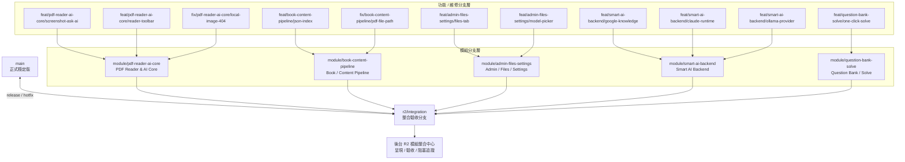
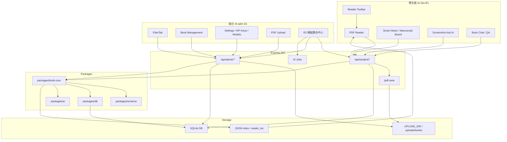
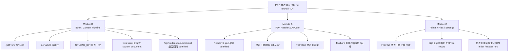

# R2 模組治理與後台整合中心總設計

> 本文件作為 AI-SmartBook R2 本次專案的總設計結構。核心目的不是單純整理分支，而是建立一套可長期維護的「模組分支治理 + 後台整合中心」架構，避免多條分支同時修改 Reader、API、FilesTab、DB 等同一批檔案，造成最後無法合併。

---

## 1. 核心問題

目前分支問題不是「太多」，而是每條分支都可能改到同一批檔案，例如：

- Reader
- API
- FilesTab
- DB
- AI provider
- PDF pipeline

結果會造成：

1. 功能分支彼此衝突。
2. 多個 agent 重複修改同一檔案。
3. PR 難以回 main。
4. PDF Reader、上傳、AI、題庫等問題混在一起，無法判斷責任歸屬。

因此 R2 需要改成：

```text
先歸模組 → 再回整合 → 最後在後台呈現與驗收
```

---

## 2. 分支治理流程

```text
feat/* 或 fix/*
    ↓
module/*
    ↓
r2/integration
    ↓
main
```

同時：

```text
r2/integration
    ↓
後台「R2 模組整合中心」呈現與驗收
```

### 2.1 main 分支規則

`main` 只接收以下來源：

- `r2/integration`
- `hotfix/*`
- `release/*`

散亂的 `feat/*` 或 `fix/*` 不得直接 merge 到 `main`。

### 2.2 模組分支規則

每個功能或維修必須先判斷屬於哪個模組，再開對應分支。

命名規則：

```text
feat/<module>/<feature>
fix/<module>/<bug>
docs/<module>/<document>
```

範例：

```text
feat/pdf-reader-ai-core/screenshot-ask-ai
fix/book-content-pipeline/pdf-file-not-found
feat/admin-files-settings/model-picker
feat/smart-ai-backend/ollama-provider
feat/question-bank-solve/my-question-bank
```

---

## 3. 分支治理圖



---

## 4. 五大模組責任邊界

| 模組 | 模組分支 | 負責範圍 |
|---|---|---|
| A. PDF Reader & AI Core | `module/pdf-reader-ai-core` | PDF 顯示、縮放、頁碼、截圖問 AI、Reader Toolbar、本機圖片、手稿板 |
| B. Book / Content Pipeline | `module/book-content-pipeline` | PDF 上傳、parse、JSON index、TOC、章節切分、filePath、UPLOAD_DIR |
| C. Admin / Files / Settings | `module/admin-files-settings` | FilesTab、檔案管理、外觀設定、API Key、模型選擇 |
| D. Smart AI Backend | `module/smart-ai-backend` | Google Knowledge、Claude/Gemini runtime、provider router、AI jobs、地端 OLLAMA |
| E. Question Bank / Solve | `module/question-bank-solve` | 一鍵解題、我的題庫、題目解析、手動 Q&A |

---

## 5. 五大模組關係圖



---

## 6. 後台 R2 模組整合中心

後台不只是管理書籍，而是整個 R2 的控制台。新增選單：

```text
後台 > R2 模組整合中心
```

此頁面負責顯示：

- 整體狀態
- 目前整合分支
- 最後驗收時間
- Build 結果
- Smoke Test 結果
- 阻塞問題清單
- PDF Reader 狀態
- AI Provider 狀態
- 檔案鏈路狀態

### 6.1 後台整合中心圖

```mermaid
flowchart TB
    ADMIN["後台 R2 模組整合中心"]

    DASH["整合總覽 Dashboard"]
    PDF["PDF Reader & AI Core"]
    PIPE["Book / Content Pipeline"]
    FILES["Admin / Files / Settings"]
    AI["Smart AI Backend"]
    QB["Question Bank / Solve"]
    LOG["驗收報告 / Build Status / Git Branch"]

    ADMIN --> DASH
    ADMIN --> PDF
    ADMIN --> PIPE
    ADMIN --> FILES
    ADMIN --> AI
    ADMIN --> QB
    ADMIN --> LOG

    DASH --> S1["模組燈號<br/>綠 / 黃 / 紅 / 灰"]
    DASH --> S2["目前分支"]
    DASH --> S3["最後驗收時間"]
    DASH --> S4["PDF 可讀狀態"]
    DASH --> S5["AI Provider 狀態"]

    PDF --> P1["PDF 顯示"]
    PDF --> P2["頁碼 / 縮放"]
    PDF --> P3["截圖問 AI"]
    PDF --> P4["Toolbar"]
    PDF --> P5["手稿板"]

    PIPE --> B1["PDF 上傳"]
    PIPE --> B2["filePath / UPLOAD_DIR"]
    PIPE --> B3["JSON Index"]
    PIPE --> B4["reader_toc"]
    PIPE --> B5["章節切分"]

    FILES --> C1["FilesTab"]
    FILES --> C2["書籍管理"]
    FILES --> C3["模型設定"]
    FILES --> C4["Google API Key"]
    FILES --> C5["Icon / Logo"]

    AI --> D1["Gemini"]
    AI --> D2["Claude"]
    AI --> D3["Google Knowledge"]
    AI --> D4["Provider Router"]
    AI --> D5["OLLAMA / 地端模型"]

    QB --> E1["一鍵解題"]
    QB --> E2["我的題庫"]
    QB --> E3["手動 Q&A"]
```



### 6.2 後台 UI Wireframe

```text
┌────────────────────────────────────────────────────────────────────┐
│ R2 模組整合中心                                                     │
├────────────────────────────────────────────────────────────────────┤
│ 整體狀態：🟡 黃燈                                                   │
│ 目前整合分支：r2/integration                                        │
│ 最後驗收：YYYY-MM-DD HH:mm                                          │
│ Student build：✅｜Admin build：⚠️｜API smoke：✅｜PDF smoke：🔴      │
├────────────────────────────────────────────────────────────────────┤
│ 模組                         狀態   分支                              │
├────────────────────────────────────────────────────────────────────┤
│ PDF Reader & AI Core          🟡    module/pdf-reader-ai-core        │
│ Book / Content Pipeline       🔴    module/book-content-pipeline     │
│ Admin / Files / Settings      🟡    module/admin-files-settings      │
│ Smart AI Backend              🟢    module/smart-ai-backend          │
│ Question Bank / Solve         ⚪    module/question-bank-solve       │
├────────────────────────────────────────────────────────────────────┤
│ 目前阻塞問題：                                                       │
│ - PDF Reader 顯示 file not found                                     │
│ - /api/student/books/:bookId/files/:fileId/pdf-view 回傳 404         │
│ - 需確認 filePath / UPLOAD_DIR / source_document / pdfFileId          │
└────────────────────────────────────────────────────────────────────┘
```

### 6.3 燈號定義

| 燈號 | 定義 |
|---|---|
| 🟢 綠燈 | 通過 typecheck / build / smoke test |
| 🟡 黃燈 | 可啟動但待驗收或有次要錯誤 |
| 🔴 紅燈 | 核心功能失敗，例如 PDF 看不到、API 404、build fail |
| ⚪ 灰燈 | 尚未整合或尚未啟用 |

---

## 7. 模組狀態資料結構

```ts
type R2ModuleStatus = {
  id: string;
  name: string;
  moduleBranch: string;
  status: "green" | "yellow" | "red" | "gray";
  lastCommit?: string;
  lastValidatedAt?: string;
  typecheckStatus?: "pass" | "fail" | "pending";
  buildStatus?: "pass" | "fail" | "pending";
  smokeTestStatus?: "pass" | "fail" | "pending";
  blockers: string[];
  ownedAreas: string[];
  relatedRoutes: string[];
  relatedFiles: string[];
};

type R2IntegrationStatus = {
  branch: string;
  overallStatus: "green" | "yellow" | "red" | "gray";
  modules: R2ModuleStatus[];
  currentBlockers: string[];
  lastReportPath?: string;
};
```

---

## 8. PDF 404 問題歸屬

目前問題不可統稱為「PDF 壞掉」，必須拆分責任。



### 8.1 PDF 404 優先檢查順序

1. `files` table 是否存在該書的 `source_document` PDF record。
2. `file.filePath` 是否指向實體存在的 PDF。
3. `UPLOAD_DIR` 是否與實際檔案位置一致。
4. `/api/student/books/:bookId` 是否回傳 `pdfFileId`。
5. `/api/student/books/:bookId/files/:fileId/pdf-view` 是否回傳 `application/pdf`。
6. Reader 是否正確取得 Blob 並交給 PDF viewer 顯示。

---

## 9. 跨模組功能拆分規則

跨模組功能不得放在單一分支大改。

例如「PDF 截圖問 AI」可能牽涉：

- Reader UI
- Screenshot region selection
- PDF page coordinate mapping
- Vision AI provider
- AI job logging

應拆成：

```text
feat/pdf-reader-ai-core/screenshot-ui
feat/book-content-pipeline/page-region-api
feat/smart-ai-backend/vision-ask-ai
```

最後才在 `r2/integration` 匯合。

---

## 10. Merge Bottleneck 與重構建議

正式實作前，必須先掃描實際 repo 檔案邊界，找出被多模組共用的瓶頸檔案。

特別注意：

```text
如果 server/index.ts 同時包含 admin files、student books、pdf-view、notes、chat、AI jobs、settings，
它就應該優先拆分成 route modules。
```

建議拆分方向：

```text
routes/adminBooks.ts
routes/adminFiles.ts
routes/adminSettings.ts
routes/studentBooks.ts
routes/studentPdf.ts
routes/studentNotes.ts
routes/studentChat.ts
routes/aiJobs.ts
routes/questionBank.ts
```

---

## 11. 實作前 Repo 驗證 Checklist

正式合併或改碼前，請先完成：

- [ ] 實際 repo 檔案邊界掃描。
- [ ] 找出被多模組共用的瓶頸檔案。
- [ ] 確認 `server/index.ts` 是否需要拆成 route modules。
- [ ] 確認 Reader、FilesTab、DB、AI provider 的真實責任邊界。
- [ ] 確認目前分支應歸屬到哪個 `module/*`。
- [ ] 建立 `r2/integration` 驗收流程。
- [ ] 設計後台 `R2 模組整合中心` 狀態資料來源。
- [ ] 先修復 PDF 404 的檔案鏈路，再處理截圖問 AI / 題庫 / 手稿板等功能。

---

## 12. 驗收標準

### 12.1 分支治理驗收

- [ ] 每個功能分支皆能對應到一個 module branch。
- [ ] `main` 不直接接收散亂 `feat/*` 或 `fix/*`。
- [ ] 跨模組功能已拆分，不在單一分支混改。
- [ ] `r2/integration` 能集中呈現各模組整合狀態。

### 12.2 後台整合中心驗收

- [ ] 後台有 `R2 模組整合中心` 頁面。
- [ ] 能顯示五大模組狀態。
- [ ] 能顯示分支、最後驗收時間、Build、Smoke Test。
- [ ] 能顯示目前阻塞問題。
- [ ] 能明確區分 PDF 404 屬於哪個模組責任。

### 12.3 PDF 404 驗收

- [ ] `/api/student/books/:bookId` 可取得 `pdfFileId`。
- [ ] `/api/student/books/:bookId/files/:fileId/pdf-view` 回傳 200 或 206。
- [ ] 回傳 `Content-Type: application/pdf`。
- [ ] Chrome 開啟 `/books/:bookId` 後 PDF 正常顯示。
- [ ] 若檔案不存在，報告需列出缺少的實體 `filePath`。

---

## 13. 最重要維護心法

以後維修先問一句：

```text
這個問題屬於哪個模組？
```

只有先回答這句，才能知道：

```text
該開哪條分支
該改哪些檔案
最後要回到哪個 module/*
要在哪個後台整合頁面驗收
```

---

## 14. 本文件定位

本文件是 R2 本次專案的總設計結構，可作為：

1. 分支治理規範。
2. 模組責任邊界文件。
3. 後台整合中心設計草案。
4. PDF 404 與其他跨模組問題的責任歸屬準則。
5. Codex / Claude / ChatGPT agent 執行任務前的共同架構基準。

正式大規模改碼前，仍需先對照真實 repo 結構完成檔案邊界掃描。