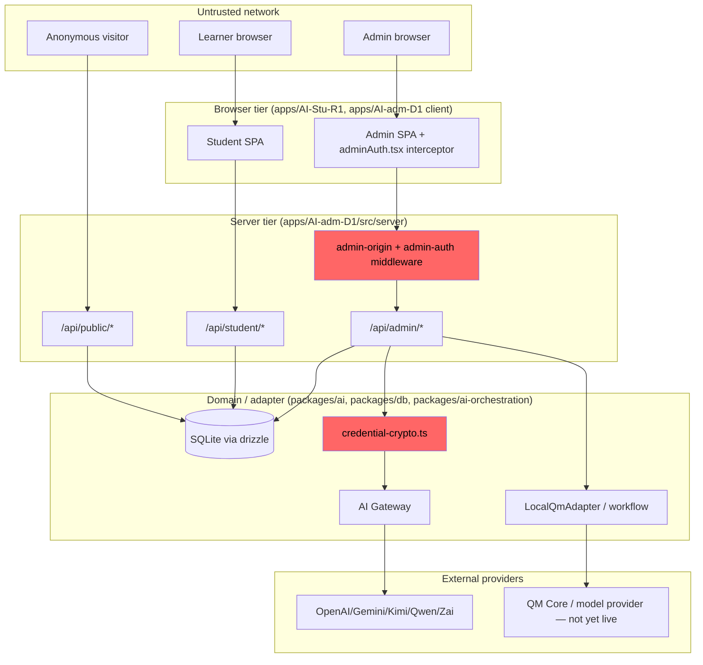
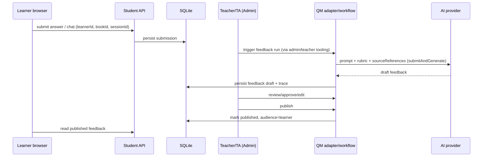

# AI_Quest_A1 Threat Model (Phase 5 Pre-work)

- Status: Draft for review
- Date: 2026-08-05
- Scope: `apps/AI-adm-D1` (Admin Web + API), `apps/AI-Stu-R1` (Student Web), `packages/ai` (gateway/providers), `packages/ai-orchestration` (QM workflow port/adapter), `packages/db`, `deploy/qm`, root `scripts/` (release/CI)
- Method: STRIDE per trust boundary + abuse-case walkthrough
- Non-goals: this document does not change product security behavior. Findings that imply a code change are logged as backlog items and cross-referenced from `SECURITY_ACCEPTANCE_MATRIX.md`.
- Assumptions flagged inline as **[ASSUMPTION]** where AGY ownership/contract state was not independently re-verified in this pass.

---

## 1. Assets

| Asset | Where it lives | Sensitivity |
| :--- | :--- | :--- |
| Admin session token (dev password / `ADMIN_API_TOKEN`) | Browser `sessionStorage`, `x-admin-token`/`Authorization` header | High — full admin API access |
| AI provider API keys | `ai_credentials.encryptedApiKey` (AES via `AI_CREDENTIAL_ENCRYPTION_KEY`), decrypted transiently per-run | Critical — billable, provider-account-scoped |
| `AI_CREDENTIAL_ENCRYPTION_KEY`, `ADMIN_API_TOKEN`, `ADMIN_DEV_PASSWORD` | root `.env` (gitignored) | Critical |
| QM deployment secrets (`ANTHROPIC_API_KEY`, `CAPABILITY_SECRET`, `CONNECTOR_SECRET_KEY`, `CORE_SIGNING_SECRET`, `PORTAL_IDENTITY_SECRET`, `SKILL_SIGNING_SECRET`, `PUBLIC_API_URL`) | `deploy/qm/.env` (gitignored) | Critical |
| Learner submissions, feedback drafts/publications, run traces | SQLite (`data/ai-smartbook-r1.db`) via `@ai-smartbook/db` | High — student PII + academic record |
| Course/book/chapter content, teacher-authored material | SQLite + uploaded files (`apps/AI-adm-D1` upload dirs) | Medium-High |
| Guest-ask visitor IP (HMAC'd) and question/answer content | SQLite `guest_ask` tables | Medium (privacy) |
| Audit log (`repos.aiProviders.audit(...)`) | SQLite | Medium — integrity matters more than confidentiality |
| QM workspace state (memory, files, keychain, sandbox run state) | QM runtime (not yet started — `qm up` blocked) | Critical once live; **currently N/A** but in scope for design |
| CI/release scripts, `deploy/qm` package lock, GitHub Actions/workflow config | Repo | High — supply-chain blast radius |

## 2. Actors & trust levels

| Actor | Trust level | Notes |
| :--- | :--- | :--- |
| Anonymous website visitor | Untrusted | `/api/public/*`, `/api/student/*` (published-book reads) |
| Learner (student) | Semi-trusted, unauthenticated-by-token today | **[ASSUMPTION]** No server-verified learner identity/session token was found on `/api/student/*` routes in this pass — client-supplied `learnerId`/session identifiers appear trusted by the server for note/chat/progress writes. Flagged as a candidate IDOR surface (Attack Case #4) pending confirmation from the owning team. |
| Teacher / TA | Trusted within their course/class scope | Scope enforcement mechanism not fully traced this pass — **[ASSUMPTION]**, flagged for Codex fixture work. |
| Admin operator | Fully trusted for `/api/admin/*` | Single shared dev password or production bearer token — no per-admin identity, no RBAC tiers within "admin". |
| CI/release pipeline | Trusted execution context | Runs `pnpm` scripts, `qm` CLI subprocess, has read access to `deploy/qm/.env` when configured |
| AI provider (OpenAI/Gemini/Kimi/Qwen/Zai, and QM's own model provider) | External, semi-trusted | Receives prompts/content; treated as a data-exfiltration and prompt-injection vector, not just a dependency |
| QM CLI subprocess | Trusted-but-sandboxed local process | Spawned with an explicit allowlisted env (`PATH`, home/temp, locale/timezone, CI metadata) plus per-run injected secret — see `buildQmRunEnv` |

## 3. Entry points

- `POST/GET /api/admin/*` — Admin API (Express), behind `createAdminOriginMiddleware` + `createAdminAuthMiddleware`
- `GET/POST /api/student/*` — Student API, no admin auth boundary
- `GET/POST /api/public/*` — Guest-ask, site config (rate-limited, IP-hashed)
- `POST /api/admin/books/:bookId/files`, appearance upload, JSON index upload — `multer`-backed file ingestion
- QM CLI subprocess invocation (`qm doctor`/`qm validate`/`qm up` via `qm-runner.ts`) — not a network entry point, but a local privilege boundary
- CI workflow triggers (push/PR) executing `pnpm` scripts and `npm exec ... qm --help`/`qm:validate`
- Vite dev proxy (`/api` → Admin API) — local-dev-only entry point, relevant to the navigation-smoke work already landed

## 4. Trust boundaries (Mermaid)

**Named boundaries:**

1. **Browser ↔ Server** — every `/api/*` call. Admin side has origin + token auth (`admin-origin.ts`, `admin-auth.ts`); student/public side has none beyond CORS-implicit same-origin and rate limiting on `guest-ask`.
2. **Domain ↔ Adapter** — `packages/ai-orchestration`'s `ports.ts` interfaces (`ensureWorkspace`, `submitAndGenerate`, etc.) separate the app's domain model from the QM-specific adapter (`LocalQmAdapter` today; a real QM API adapter later). Contracts in `packages/contracts` are the DTO boundary and must stay free of QM-internal or provider-internal types.
3. **AI orchestration ↔ Provider** — `CredentialBackedProvider` decrypts a credential transiently, builds a fresh per-run env (`buildQmRunEnv`/`buildIsolatedRunSecretEnv`), and calls out; the boundary is meant to guarantee no shared-process secret leakage and fail-closed resolution (`resolveQmRuntimeConfig`) on every call, not just at save time.
4. **Teacher ↔ Learner scope** — course/class/assignment ownership should gate who can review/publish feedback and who can read which submissions. **[ASSUMPTION — needs confirmation]**: this pass did not find a single centralized scope-check function analogous to `admin-auth.ts`; enforcement appears distributed across individual routes/services. This is the top scope-isolation risk in §8.

## 5. Data flows (high-value)

Prompt injection surface: `submission.content`, `sourceReferences` (lesson/book excerpts), and any teacher-uploaded PDF/教材 text all flow into the prompt sent to `P`. See Attack Cases #7–#8.

## 6. Abuse assumptions

- Learners and anonymous visitors are assumed hostile (will attempt IDOR, oversized uploads, prompt injection).
- Teachers/TAs are assumed honest-but-fallible (will paste untrusted external content into prompts, may share credentials).
- Admin dev password is assumed to leak in local/dev environments (documented as insecure-by-design for non-production) — production must use `ADMIN_API_TOKEN` and `NODE_ENV=production`; this document does not re-litigate that decision but flags it as a control the acceptance matrix must gate on.
- AI providers are assumed to log/retain prompts server-side outside this system's control — no secret or full-PII payload should ever be part of a prompt.
- CI runners are assumed to have no persistent secret material beyond what's explicitly injected per job.

## 7. Existing controls (verified this session or in prior rounds)

- Single canonical admin auth policy (`isAcceptedAdminToken`/`candidateAdminToken`/`sendAdminAuthRequired`), applied both at the global `/api/admin` middleware and route-local defense-in-depth — see `docs/adr/ADR-ADMIN-AUTH-CONTRACT.md`.
- Exact, single-emitter `ADMIN_AUTH_REQUIRED` + `X-Admin-Auth-State` marker contract prevents business errors from being misclassified as auth failures, and vice versa.
- Admin browser session invalidation is token-snapshot-guarded (single-flight, stale-response-safe) — regression-gated by `pnpm admin:navigation-smoke`.
- `isSafeQmBaseUrl` SSRF guard blocks loopback/RFC1918/CGNAT/link-local/cloud-metadata/IPv6-mapped targets at both schema and resolve time.
- QM Runtime Settings store only references (`providerConfigId`/`credentialId`/`model`/`baseUrlOverride`); browser only ever receives `maskedApiKey`.
- Per-run secret isolation: `buildIsolatedRunSecretEnv` decrypts inside a bounded closure and merges into a fresh subprocess env, never `process.env`.
- 9 exact fail-closed QM runtime error codes, re-resolved on every GET/PUT/test call (not cached).
- Guest-ask has rate limiting (`429` responses observed at `index.ts:3197,3210`) and hashes visitor IP (`hmacVisitorIp`) rather than storing it raw.
- Upload filename sanitization (`sanitizeUploadFileName`) applied to book files, appearance images, and JSON index uploads.
- Appearance/JSON uploads have explicit `multer` size limits (2MB / 25MB) and a `fileFilter`.
- Filename-only secret scanning + redacted JSON artifacts (`release-artifacts.mjs`) used throughout release scripts and the new navigation smoke.
- QM deployment secrets documented as never auto-generated to force Doctor green; `deploy/qm/.env` verified gitignored and untracked.

## 8. Missing / unverified controls (this pass's top findings)

| ID | Gap | Boundary | Why it matters |
| :--- | :--- | :--- | :--- |
| TM-1 | Book upload route (`app.post("/api/admin/books/:bookId/files", upload.single("file"), ...)`) uses `multer({ storage })` with **no `limits.fileSize`**, unlike the appearance (2MB) and JSON-index (25MB) uploaders. | Upload ingestion | Unbounded upload size → disk-exhaustion DoS; see Attack Case #11. |
| TM-2 | No server-verified learner identity found on `/api/student/*` note/chat/progress routes in this pass — client-supplied identifiers appear trusted. | Browser↔Server, IDOR | If confirmed, any visitor can read/write another learner's notes/progress by guessing/enumerating IDs. **[ASSUMPTION — requires Codex/owner confirmation before treating as confirmed vulnerability.]** |
| TM-3 | No single centralized teacher/TA course-and-class scope check analogous to `admin-auth.ts` was found; enforcement appears per-route. | RBAC/ABAC | Risk of an inconsistent guard (the same pattern that caused the Round 4 admin-nav bug) recurring in the teacher/learner scope layer. |
| TM-4 | Prompt injection surface (submission content, source references, teacher-pasted external content) has no documented sanitization/guardrail layer distinct from the provider call itself. | AI orchestration ↔ Provider | Indirect prompt injection via teaching material is plausible and untested. |
| TM-5 | QM workspace/memory/file/keychain isolation across `orgId`/`scopeId`/`ownerId`/`sharedWithIds` is defined in `ports.ts` types but this pass did not find enforcement tests proving cross-workspace access is actually blocked (only happy-path tests were observed). | QM adapter | Design-time only; needs explicit negative tests once QM is live. |
| TM-6 | Admin has no per-operator identity — a single shared token/password means the audit log's `adminActorId` (a hash of the token) is the only "who," and it changes if the shared secret rotates. | Audit / accountability | Acceptable for current single-operator-team stage but should be flagged as a residual risk, not silently assumed away. |
| TM-7 | CI/release script supply chain: `npm exec --package=@yc-software/qm@0.1.4` pulls from the registry at gate time rather than a locked/vendored artifact. | CI/CD supply chain | A compromised/yanked `@yc-software/qm@0.1.4` release could execute in CI; mitigated partially by version pinning but not by hash pinning or an offline mirror. |

## 9. Residual risk (accepted, with rationale)

- **QM Core/Web UI/Sandbox/Memory/Files/live inference are entirely unexercised** — `qm up` has never run in this environment. All associated risk is design-review-only; no live control can be verified until an authorized runtime pass exists. This is intentional per the branch's `CONTRACT_ONLY_ACCEPTED_RUNTIME_BLOCKED` verdict and is not a defect of this document.
- **Single shared admin credential** (TM-6) is accepted for the current team size; revisit if the admin user base grows.
- **Dev-password fallback in non-production** is an intentional, documented insecure default (`DEFAULT_ADMIN_DEV_PASSWORD`), gated by `NODE_ENV !== "production"`; residual risk is misconfiguration (deploying with `NODE_ENV` unset), which the acceptance matrix should gate on.

## 10. Cross-references

- `docs/security/ATTACK_CASES.md` — concrete, reproducible cases for each numbered category in Issue #16 §B, including TM-1 through TM-5 above.
- `docs/security/SECURITY_ACCEPTANCE_MATRIX.md` — Threat→Control→Test→Evidence→Owner→Gate mapping.
- `docs/adr/ADR-ADMIN-AUTH-CONTRACT.md` — admin auth contract this model treats as an existing control.
- `docs/ops/qm-installation-and-local-run.md` — current QM verification state (Contract PASS / Doctor BLOCKED), referenced for §9 residual risk.
